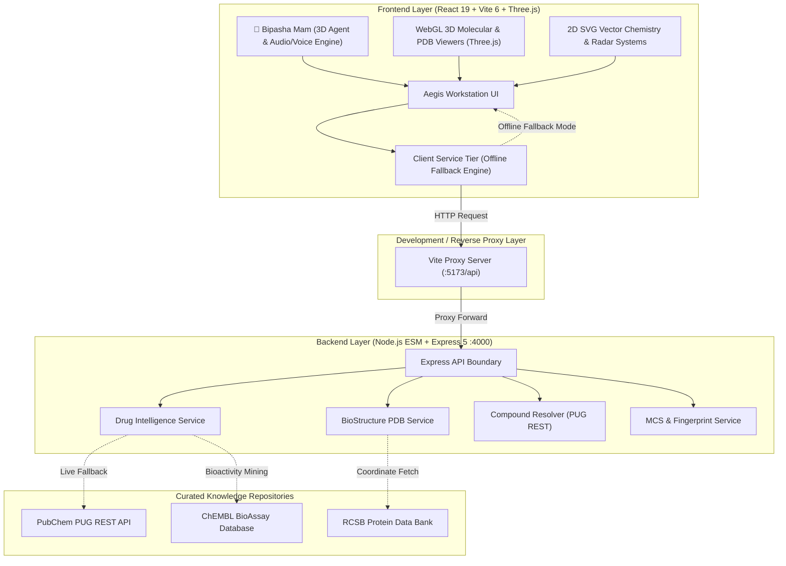

# 🧬 Aegis Molecular Platform
### AI-Powered Drug–Target Interaction & Computational Biology Workstation

[](https://nodejs.org/)
[](https://react.dev/)
[](https://vitejs.dev/)
[](https://threejs.org/)
[](https://expressjs.com/)
[](file:///workspaces/AI-Drug-Target-Interaction-Prediction/tests)
[](#license)

---

## 📌 Executive Summary

The **Aegis Molecular Platform** is an enterprise-grade, research-oriented computational chemistry, molecular biology, and drug discovery intelligence workstation. It bridges high-resolution 3D macromolecular visualization, quantum and empirical descriptor calculation, Maximum Common Substructure (MCS) graph alignment, pharmacokinetic/ADMET profiling, and explainable deep-learning Drug–Target Interaction (DTI) predictions into a unified, dark-laboratory scientific interface.

Anchoring the workstation is **"Bipasha Mam"**, a persistent 3D AI research assistant and navigation agent positioned at the bottom-right corner of the application. The platform integrates authoritative structural and biochemical repositories—including the **Protein Data Bank (RCSB PDB)**, **PubChem**, and **ChEMBL**—with robust in-browser fallback computation, ensuring high availability both online and offline.

> [!IMPORTANT]
> **Scientific Research & Non-Clinical Safety Notice:**
> The Aegis Molecular Platform is engineered strictly for pharmaceutical research, computational chemistry modeling, and biomedical education. It does **not** provide clinical diagnosis, patient-specific medical advice, prescription generation, or dosage adjustments. In-silico predictions represent computational hypotheses that require experimental in-vitro/in-vivo laboratory validation.

---

## 🗺️ System Architecture



---

## 🔬 Core Workstation Modules

### 1. 🤖 "Bipasha Mam" — Persistent 3D AI Research Agent
* **Visual Representation:** A floating, luminescent emerald 3D AI orb positioned in the lower-right application viewport, featuring ambient particle halos, rotational torque, and scientific pulse states.
* **Multi-Stage Progress System:** Visual 5-stage progress indicator tracking operations across 0% to 100% (Identifier Resolution $\to$ Descriptor Synthesis $\to$ Target Topology $\to$ DTI Calibration $\to$ Dossier Ready).
* **Natural Language Intent Parser:** Semantic query engine parsing user requests (e.g., *"check ciprofloxacin interactions"*, *"explore 2XCT binding pocket"*, *"compare benzene and toluene"*) and navigating automatically to target modules.
* **Contextual Greeting Engine:** Dynamically adapts conversation greetings and quick-action triggers to the user's active viewport.
* **Audio & Voice Synthesis:** Web Audio API synthesized laboratory audio cues (chimes, clicks, alerts, ambient orb hums) and Web Speech API text-to-speech feedback.
* **Safety Boundaries:** Built-in ethical and non-clinical guardrails filtering out prescribing or medical advice requests.

---

### 2. 💊 Drug Intelligence & Analysis Workstation (`DrugAnalysisView`)
A comprehensive, multi-dimensional drug intelligence platform inspired by the analytical capabilities of DrugBank, PubChem, and ChEMBL:

* **Universal Multi-Parameter Search:** Instant search across drug names, synonyms, PubChem CIDs, ChEMBL IDs, ATC classifications, targets, and SMILES strings.
* **Flagship Reference Library:** Embedded flagship records for 10 diverse therapeutic classes:
  1. **Ciprofloxacin** (Fluoroquinolone Antibacterial)
  2. **Aspirin** (NSAID / Antiplatelet)
  3. **Caffeine** (Purinergic Psychostimulant)
  4. **Ibuprofen** (Propionic Acid Derivative)
  5. **Paracetamol** (Analgesic & Antipyretic)
  6. **Imatinib** (Tyrosine Kinase Inhibitor Antineoplastic)
  7. **Metformin** (Biguanide Antihyperglycemic)
  8. **Atorvastatin** (HMG-CoA Reductase Inhibitor)
  9. **Indomethacin** (Indole Acetic Acid NSAID)
  10. **Tamoxifen** (Selective Estrogen Receptor Modulator)
* **Dual 2D/3D Structural Inspection:** Clean SVG 2D chemical skeletons paired with an interactive Three.js 3D viewport (Ball & Stick, Spacefill/CPK, Wireframe, Ribbon).
* **7-Axis Physicochemical Radar:** Real-time polygonal radar plotting Lipophilicity (LogP), Molecular Size (MW), Polarity (TPSA), Solubility (LogS), Flexibility (RotBonds), Charge, and H-Bonding against optimal oral bioavailability envelopes.
* **Drug-Likeness Rules:** Automated compliance evaluation for Lipinski's Rule of 5 (with violation counts), Veber rules, Ghose filters, and Abbot bioavailability scores.
* **Bemis–Murcko Scaffolds & Chemotypes:** Automatic deconstruction into Murcko frameworks, identifying core ring systems, linker atoms, and peripheral functional groups.
* **Bioactivity Intelligence Matrix:** Filterable tables covering experimental assay data (`IC50`, `Ki`, `Kd`, `EC50`, `MIC`), assay descriptions, organism, and source links.
* **Target Intelligence Cards & 1-Click Bridges:**
  * `[🔬 Open in BioStructure Hub]`: Instantly transfers target crystal accessions (e.g., PDB `2XCT`) to the 3D structural biology viewer.
  * `[⚡ Test Affinity in DTI Lab]`: Bridges drug SMILES and target names directly into the in-silico screening pipeline.
* **AI Drug Intelligence Graph:** Interactive SVG topological network mapping multi-tier relationships: $\text{Drug} \longleftrightarrow \text{Targets} \longleftrightarrow \text{Pathways} \longleftrightarrow \text{Diseases}$.
* **Pairwise CYP Drug-Drug Interaction (DDI) Engine:** Interactive 2-drug selector computing metabolic cytochrome P450 pathway competition (CYP1A2, CYP2C9, CYP2D6, CYP3A4), interaction severity (Contraindicated, Major, Moderate, Minor), and dietary/food advisories.
* **ADMET Pharmacokinetics & 6-Step MoA Timeline:** Human Intestinal Absorption (HIA), Caco-2 permeability, Blood-Brain Barrier (BBB) penetration, Plasma Protein Binding (PPB), Volume of Distribution ($V_d$), renal clearance, and half-life alongside a visual 6-stage biological cascade.
* **Clinical Indications, PGx & Clinical Trials:** Approved and investigational disease mappings, Pharmacogenomics (PGx) biomarkers with PharmGKB evidence levels, and ClinicalTrials.gov NCT identifiers.
* **Evidence Confidence Hierarchy:** Explicit multi-tier grading distinguishing `[Experimental Ground Truth]`, `[Curated Reference]`, `[Calculated Descriptor]`, and `[In-Silico Prediction]`.
* **Grounded AI Drug Analyst ("Ask the Drug"):** Context-bounded conversational Q&A grounded strictly in the active drug's pharmacological dossier.
* **Explainable In-Silico DTI Predictor:** Machine learning affinity estimation ($-\log K_d$, probability) equipped with SHAP/Integrated Gradients feature attribution waterfall diagrams.
* **Similar Drugs Explorer & SAR Rules:** Topological Morgan fingerprint Tanimoto structural similarity ranking with 1-click bridge to side-by-side Structure Comparison.
* **Guided Drug Journey Storytelling:** 10-step interactive pedagogical journey tracking a molecule from Target Identification to Clinical Approval.
* **Research Workspace & Dossier Export:** Local storage persistence for bookmarks and personal research notes, with 1-click export to publication-grade **Markdown (`.md`)** and structured **JSON (`.json`)**.

---

### 3. 🧬 BioStructure Intelligence Hub (`BioStructureHubView`)
An advanced structural biology workspace inspired by RCSB PDB capabilities:

* **3D Macromolecular Complex Rendering:** High-performance WebGL rendering of multi-chain proteins, nucleic acids, bound crystallographic ligands, water molecules, and coordinated metal ions.
* **PDB Parser:** Complete client/server hierarchy parsing chains, residue sequences, secondary structure (alpha-helices, beta-sheets), resolution, space group, and deposition metadata.
* **Binding Site & Cavity Intelligence:** Automatic pocket identification with Voronoi/geometric grid volume calculations ($\text{\AA}^3$), Solvent Accessible Surface Area (SASA), and contact residue mapping within a 4.5Å Euclidean sphere.
* **Interaction Vector Calculation:** Detects and renders 3D dashed interaction vectors for hydrogen bonds (donor-acceptor $\le 3.5\text{\AA}$), salt bridges, $\pi$-stacking, and hydrophobic contacts.
* **Per-Residue Sequence Mapping:** Interactive amino acid sequence strip showing contact hot-spots, secondary structure types, and per-residue B-factor / pLDDT confidence metrics.
* **Experimental Quality Assessment:** Comprehensive diffraction analytics including R-work, R-free, resolution, and coordinate validation flags.
* **Cα Structural Alignment & RMSD:** Pairwise structural superimposition computing Root Mean Square Deviation (RMSD) and conformational variance.
* **AI Structure Interpreter:** Grounded structural query assistant answering geometric and biochemical inquiries about the active complex.

---

### 4. 🔬 Structure Comparison & Common Substructure Analysis (`StructureComparisonView`)
A cheminformatics module for pairwise molecular comparison:

* **Dual Compound Input:** Flexible selection of Compound A and Compound B via flagship libraries, SMILES, PubChem name, or chemical formulas.
* **Synchronized 2D/3D Viewers:** Side-by-side synchronized molecular inspectors with coordinate alignment and interactive orbit controls.
* **Maximum Common Substructure (MCS) Engine:** Graph-based Bron-Kerbosch clique algorithm calculating the largest common chemical core.
* **Visual Substructure Alignment:** Shared scaffolds highlighted in emerald green; divergent functional groups and substituents color-coded in orange/cyan.
* **Cheminformatics Metrics:** Exact quantitative similarity via Morgan circular topological fingerprints (Tanimoto coefficient, Dice similarity, Cosine distance).
* **Delta Property Comparison Table:** Calculates and formats absolute differences ($\Delta\text{MW}$, $\Delta\text{LogP}$, $\Delta\text{TPSA}$, $\Delta\text{HBD}$, $\Delta\text{HBA}$, $\Delta\text{RotBonds}$).
* **Comparative Bioactivity & Target Profiles:** Displays divergent target selectivities and binding mode shifts across congeners.

---

### 5. ⚗️ Visualize the Compound (`VisualizeCompoundView`)
A dedicated molecular inspection workstation:

* Dynamic compound resolution via PubChem PUG REST API.
* Multi-representation switching: **Ball & Stick**, **Spacefill (van der Waals radii)**, **Wireframe / Sticks**, and **Backbone**.
* Atom-level hover tooltip showing element name, atomic index, hybridization state, and 3D spatial coordinates.
* Export molecular conformers as V2000 `.mol`, `.sdf`, high-resolution `.png`, or `.json`.

---

### 6. 🎨 Aegis Molecular Studio (`MoleculeLabView`)
An interactive 2D chemical structure editor:

* Interactive graph canvas allowing custom atom placement, bond creation (single, double, triple), and charge assignment.
* Chemical template stampers: Benzene, Cyclohexane, Naphthalene, Pyridine, and Steroid cores.
* Real-time deterministic chemical descriptors: Formula generation, molecular weight, ring counters, and heavy atom counts without fabricated valences.
* Clean V2000 MOL export preserving graph topology.

---

### 7. ⚡ Additional Discovery Modules
* **DTI Prediction Lab (`DtiLabView`):** Multi-target screening console scoring binding probability and affinity metrics.
* **Target Analysis Workstation (`TargetAnalysisView`):** Macromolecular target inspector cataloging signaling pathways and cellular locations.
* **Medicine Cabinet & Expiry Monitor (`Medicines.jsx` & `ExpiryMonitorView.jsx`):** Clinical sample tracker with a 7-day expiry classification window and storage monitoring.

---

## 🛠️ Technology Stack

| Layer | Technologies | Purpose |
| :--- | :--- | :--- |
| **Frontend Framework** | React 19, Vite 6 | High-speed component rendering, reactive state management, and modern build tooling |
| **3D Molecular Graphics** | Three.js (r186), WebGL | Hardware-accelerated 3D protein, ligand, and binding pocket rendering |
| **Icons & Typography** | Lucide React, Space Grotesk, Manrope, DM Mono | Scientific dark laboratory aesthetic and monospace data displays |
| **Audio & Speech** | Web Audio API, Web Speech API | Synthesized laboratory sound effects and natural voice readback for Bipasha Mam |
| **Backend Runtime** | Node.js (v20+ ESM), Express 5 | Asynchronous REST API boundary, CORS handling, and computational pipelines |
| **Cheminformatics** | Custom graph algorithms, Morgan circular fingerprints | Tanimoto similarity, MCS Bron-Kerbosch, Lipinski/Veber/Ghose descriptors |
| **External Integrations** | PubChem PUG REST, RCSB PDB REST, ChEMBL | Live structural data, chemical resolution, and bioactivity assay retrieval |
| **Testing** | Native Node.js Test Runner (`node:test`) | Unit, integration, and algorithmic benchmark test suite |

---

## 🚀 Getting Started

### Prerequisites
* **Node.js**: `v20.0.0` or higher
* **npm**: `v10.0.0` or higher

### 1. Installation
Clone the repository and install project dependencies:
```bash
git clone https://github.com/Shailesh8708/AI-Drug-Target-Interaction-Prediction.git
cd AI-Drug-Target-Interaction-Prediction
npm install
```

### 2. Environment Configuration
Create a `.env` configuration file from the example:
```bash
cp .env.example .env
```
Default configuration values:
```env
PORT=4000
VITE_API_BASE_URL=
```

### 3. Running the Application

#### Option A: Run Full Stack (Frontend + Backend Together) — Recommended
```bash
npm run dev
```
* **Frontend Application:** [http://localhost:5173](http://localhost:5173)
* **Backend Express API:** [http://localhost:4000/api/health](http://localhost:4000/api/health)
* The frontend automatically proxies `/api/*` requests to the backend server at port `4000`.

#### Option B: Run Services Individually in Separate Terminals
```bash
# Terminal 1: Launch Backend API Server
npm run dev:server

# Terminal 2: Launch Frontend Client
npm run dev:client
```

---

## 🔌 REST API Reference

The backend Express server exposes endpoints under `/api`:

### 🩺 System & Health
| Method | Endpoint | Description |
| :--- | :--- | :--- |
| `GET` | `/api/health` | Returns API status, service name, and execution phase |
| `GET` | `/api/models` | Returns available machine learning model registry entries |

### 💊 Drug Intelligence & Analysis
| Method | Endpoint | Description |
| :--- | :--- | :--- |
| `GET` | `/api/drugs/search?q={query}` | Search drug library and live repositories by name, target, or SMILES |
| `GET` | `/api/drugs/:id` | Retrieve comprehensive pharmacological profile for a specific drug |
| `POST` | `/api/drugs/ddi` | Evaluate pairwise Drug-Drug Interactions and CYP enzyme competition |
| `POST` | `/api/drugs/ask` | Natural language Q&A grounded strictly in the drug profile |
| `POST` | `/api/drugs/predict-dti` | In-silico DTI affinity prediction with explainable feature attributions |

### 🧬 Structural Biology & RCSB PDB
| Method | Endpoint | Description |
| :--- | :--- | :--- |
| `GET` | `/api/structure/pdb/:id` | Parse and retrieve 3D macromolecular complex hierarchy for a PDB ID |
| `POST` | `/api/structure/pocket` | Calculate binding pocket volume, SASA, and contact residues within 4.5Å |
| `POST` | `/api/structure/similarity` | Calculate Morgan circular fingerprint Tanimoto structural similarity |
| `POST` | `/api/structure/align` | Perform pairwise Cα structural alignment and compute RMSD |
| `POST` | `/api/structure/ask` | Grounded AI Q&A answering structural biology inquiries about a complex |

### 🔬 Compound Resolution & Comparison
| Method | Endpoint | Description |
| :--- | :--- | :--- |
| `GET` | `/api/compounds/resolve?q={query}` | Resolve compound identifiers via PubChem PUG REST |
| `GET` | `/api/compounds/autocomplete?term={q}` | Fast autocomplete for chemical names and formulas |
| `POST` | `/api/compounds/compare` | Compare two compounds; compute MCS and delta descriptors |

---

## 🧪 Testing & Validation

The test suite runs using Node's native test runner (`node:test`) and asserts algorithmic correctness, chemistry parsing integrity, and API contracts.

Run the test suite:
```bash
npm test
```

### Test Coverage (33 Passing Tests)
```text
✔ BioStructure: Parses 2XCT PDB coordinates and extracts complex hierarchy
✔ BioStructure: Calculates binding pocket, contacts, and volume for 2XCT
✔ BioStructure: Circular topological fingerprint Tanimoto similarity search
✔ BioStructure: Pairwise Cα structural alignment computes RMSD and differences
✔ BioStructure: AI Structure Interpreter answers grounded questions safely
✔ BioStructure: Generates comprehensive publication report with disclaimer
✔ Action Registry contains all 10 required project modules
✔ Staged progress bar returns valid stage definitions across 0-100%
✔ Intent parser accurately maps natural language requests to actions
✔ Intent parser enforces non-clinical and non-prescriptive safety boundaries
✔ Contextual greetings adapt properly to active route
✔ Drug Intelligence: Flagship library contains authentic data across 10 drug classes
✔ Drug Intelligence: Resolves Ciprofloxacin profile with full molecular & target intelligence
✔ Drug Intelligence: Universal search recognizes drug names, synonyms, and target mechanisms
✔ Drug Intelligence: Evaluates Pairwise Drug-Drug Interaction (DDI) & CYP enzyme competition
✔ Drug Intelligence: AI Drug Analyst generates grounded answers strictly based on pharmacology
✔ Drug Intelligence: In-silico DTI predictor outputs explainable feature attributions
✔ Drug Intelligence: Generates publication-grade research report in Markdown with safety disclaimer
✔ classifies medicines inside the default seven-day window
✔ template insertion creates a structured aromatic graph
✔ atom and bond editing updates deterministic descriptors
✔ empty and malformed structures are reported without fabricated chemistry
✔ MOL export preserves the graph rather than rendering a screenshot
✔ simple SMILES becomes an editable graph and malformed input is rejected
✔ PDB parsing preserves protein hierarchy and imported metadata
✔ nearby residue candidates use imported 3D coordinates and explicit cutoff
✔ unsupported mmCIF input is reported instead of silently parsed
✔ Test 1 — Benzene vs Toluene: identifies benzene core MCS and methyl addition
✔ Test 2 — Ethanol vs Methanol: calculates molecular formula and descriptor differences
✔ Test 3 — Caffeine vs Theobromine: compares purine rings and methyl substituents
✔ Test 4 — Structurally unrelated molecules: handles low similarity safely
✔ Test 5 — Invalid / empty inputs: rejects safely without crashing
✔ Test 6 — MCS search timeout protection works gracefully

ℹ tests 33 | pass 33 | fail 0 | duration_ms ~1500ms
```

### Production Build Validation
Verify that the React/Vite bundle builds with zero errors or syntax warnings:
```bash
npm run build
```

---

## 📁 Repository Structure

```text
.
├── server/
│   ├── index.js                            # Express 5 API application & endpoint routes
│   └── services/
│       ├── bioStructureService.js          # PDB coordinate parsing, pocket analysis & RMSD
│       ├── compoundResolver.js             # PubChem PUG REST integration & SDF parser
│       ├── drugIntelligenceService.js      # Drug library, DDI engine, Q&A, and in-silico DTI
│       └── structureComparison.js          # MCS Bron-Kerbosch algorithm & fingerprint math
├── src/
│   ├── App.jsx                             # Master application layout, navigation, notice bar
│   ├── main.jsx                            # Application entry point
│   ├── components/
│   │   ├── bipasha/                        # "Bipasha Mam" 3D AI agent components
│   │   │   ├── BipashaAgent.jsx            # Floating 3D AI agent interface & controls
│   │   │   ├── BipashaOrbCanvas.jsx        # Three.js 3D emerald circular orb canvas
│   │   │   ├── BipashaProgressBar.jsx      # 5-stage visual progress bar (0-100%)
│   │   │   ├── BipashaActionRegistry.js    # Module registry, intent parser, safety guards
│   │   │   ├── BipashaSoundEngine.js       # Web Audio API procedural sound synthesizer
│   │   │   └── bipasha.css                 # Glassmorphic orb and agent styling
│   │   ├── biostructure/                   # BioStructure Intelligence Hub
│   │   │   ├── BioStructure3DViewer.jsx    # Three.js macromolecular WebGL canvas
│   │   │   ├── BioStructureSequenceView.jsx# Per-residue interaction & sequence strip
│   │   │   ├── BioStructurePocketsPanel.jsx# Binding pocket volume & contacts inspector
│   │   │   ├── BioStructureReportModal.jsx # Publication-grade dossier generator
│   │   │   └── biostructure.css            # Structural biology styles
│   │   ├── comparison/                     # Structure Comparison module
│   │   │   ├── StructureComparisonViewer.jsx# Synchronized 2D/3D dual inspectors
│   │   │   ├── MCSHighlightCanvas.jsx      # Substructure overlay canvas
│   │   │   └── comparison.css              # Side-by-side comparison styles
│   │   ├── drugintelligence/               # Drug Intelligence & Analysis workstation
│   │   │   ├── DrugSearchHeader.jsx        # Universal search & flagship pill selectors
│   │   │   ├── DrugProfileHeader.jsx       # Identity banner, ATC, approval status
│   │   │   ├── DrugStructureViewer.jsx     # Dual 2D SVG & 3D Three.js molecular viewer
│   │   │   ├── ChemicalPropertiesPanel.jsx # Lipinski, Veber, Ghose, bioavailability
│   │   │   ├── PhysicochemicalRadar.jsx    # 7-axis bioavailability radar chart
│   │   │   ├── FunctionalGroupScaffoldPanel.jsx # Bemis-Murcko scaffolds & functional groups
│   │   │   ├── BioactivityIntelligencePanel.jsx # Filterable IC50/Ki/Kd assay matrix
│   │   │   ├── TargetIntelligencePanel.jsx # Target cards with BioStructure/DTI bridges
│   │   │   ├── DrugTargetNetworkGraph.jsx  # Interactive SVG Drug-Target-Pathway graph
│   │   │   ├── DrugInteractionsPanel.jsx   # Pairwise CYP DDI checker & food warnings
│   │   │   ├── ADMEPharmacologyPanel.jsx   # Pharmacokinetics & 6-step MoA timeline
│   │   │   ├── DiseasePharmacogenomicsPanel.jsx # Indications, PGx biomarkers, trials
│   │   │   ├── LiteratureEvidenceMatrix.jsx# Multi-tier evidence confidence matrix
│   │   │   ├── AIDrugAnalystPanel.jsx      # Grounded "Ask the Drug" conversational Q&A
│   │   │   ├── ExplainableDTIComparison.jsx# Experimental truth vs ML SHAP attributions
│   │   │   ├── SimilarDrugsSARPanel.jsx    # Morgan Tanimoto similarity & SAR rules
│   │   │   ├── DrugJourneyStoryMode.jsx    # 10-step pedagogical drug discovery journey
│   │   │   ├── ResearchWorkspaceModal.jsx  # Bookmarks & notes with localStorage sync
│   │   │   ├── DrugReportModal.jsx         # Publication Markdown/JSON export modal
│   │   │   └── drugintelligence.css        # Dark laboratory workstation CSS
│   │   ├── views/                          # Page view components
│   │   │   ├── DrugAnalysisView.jsx        # Master Drug Intelligence workstation
│   │   │   ├── BioStructureHubView.jsx     # BioStructure Intelligence Hub page
│   │   │   ├── StructureComparisonView.jsx # Structure Comparison page
│   │   │   ├── VisualizeCompoundView.jsx   # Compound 2D/3D visualization page
│   │   │   ├── MoleculeLabView.jsx         # Aegis Molecular Studio editor
│   │   │   ├── DtiLabView.jsx              # DTI prediction screening lab
│   │   │   ├── TargetAnalysisView.jsx      # Biological target analysis page
│   │   │   ├── Medicines.jsx               # Personal medicine cabinet
│   │   │   ├── ExpiryMonitorView.jsx       # Medicine expiry tracking
│   │   │   └── AnalyticsView.jsx           # Model metrics & pipeline telemetry
│   │   └── shared/                         # Reusable navigation, disclaimer & UI cards
│   └── services/                           # Client-side communication & offline fallbacks
│       ├── api.js                          # Base API fetch client
│       ├── bioStructureService.js          # Client PDB loader & pocket calculation
│       ├── drugIntelligenceService.js      # Client drug intelligence, DDI, and storage
│       ├── molecularModel.js               # SMILES parser & descriptor math
│       ├── proteinModel.js                 # Residue & chain models
│       └── structureComparisonService.js   # Client comparison caller & fallback math
├── tests/                                  # Node.js automated test runner suites
│   ├── bioStructure.test.js                # 6 BioStructure Hub tests
│   ├── bipashaAgent.test.js                # 5 Bipasha Mam agent tests
│   ├── drugIntelligence.test.js           # 7 Drug Intelligence tests
│   ├── expiry.test.js                      # 1 Expiry domain test
│   ├── moleculeLab.test.js                 # 5 Molecular Studio tests
│   ├── proteinParsing.test.js              # 3 PDB structure tests
│   └── structureComparison.test.js         # 6 MCS & comparison tests
├── package.json                            # Scripts, dependencies, and configuration
├── vite.config.js                          # Vite bundler & reverse proxy configuration
└── README.md                               # Comprehensive documentation
```

---

## 🔒 Scientific Governance & Data Integrity

1. **Experimental vs. Predicted Separation:**
   Every analytical panel visibly marks data sources with explicit badges:
   * `[Experimental]`: Direct X-ray crystallography, NMR, or wet-lab bioassay measurements.
   * `[Curated]`: Manually reviewed literature from FDA labels, DailyMed, or PharmGKB.
   * `[Calculated]`: Empirical cheminformatics metrics (e.g., Lipinski descriptors, Morgan fingerprints).
   * `[Predicted]`: Machine learning model inferences requiring laboratory confirmation.

2. **Deterministic Computation:**
   Molecular properties (molecular weight, hydrogen bond counts, rotatable bonds, topological polar surface area) are computed deterministically from verified molecular graphs rather than hallucinated by language models.

3. **Client-Side Resilience:**
   All major workstations incorporate local fallback algorithms and embedded reference libraries, ensuring that the platform remains interactive and fully explorable even in disconnected environments.

---

## 📄 License

This project is licensed under the **MIT License**. See the `LICENSE` file for details.
