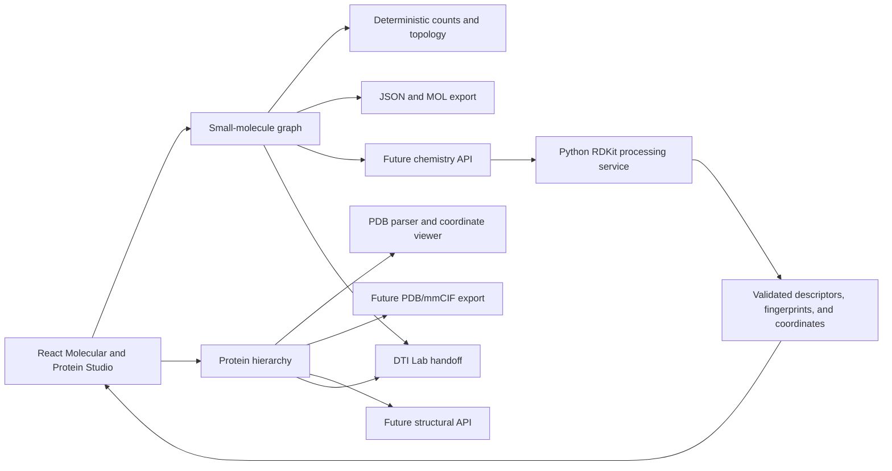

# Architecture

Aegis is intentionally split into a Vite React client and an Express API boundary.

- `src/` contains feature-oriented UI surfaces and reusable visual components.
- `server/` is the future home for routes, validation, services, and model orchestration.
- `data/raw/` and `data/processed/` separate source datasets from reproducible outputs.
- `models/` is reserved for versioned trained artifacts and is ignored by Git.
- `tests/` contains executable domain checks that can grow into client and API suites.

The first phase uses local display state only. It does not claim to run a trained model or connect to a medical data source.

## Molecular and Protein Studio

The unified studio route at `src/components/views/MolecularProteinStudioView.jsx` switches between small molecules and imported protein structures without replacing the existing editor. Small molecules use the structured graph in `src/services/molecularModel.js`. Proteins use the hierarchy in `src/services/proteinModel.js`: chains, residues, atoms, metadata, secondary-structure records, and imported ligands.

The protein viewport uses a lazily loaded Three.js WebGL point/backbone renderer for imported coordinates, with explicit fallback messaging when WebGL is unavailable. It does not invent conformer coordinates. A future RDKit/structural service can return validated coordinates, surfaces, contacts, and descriptors through the same object boundary without replacing the editor.
